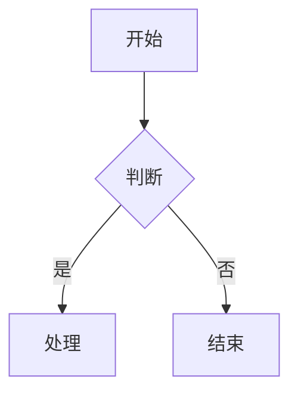
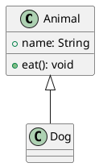

# Markdown 预览器

这是一个极简风格的 Markdown 文件预览工具，专为 GitHub Pages 设计，完全静态，无需后端。

## 功能特点

- 📂 **自动发现** - 通过 GitHub API 自动扫描仓库中的所有 .md 文件
- 🌳 **树形文件结构** - 自动构建文档目录树
- 📱 **完美适配移动端** - 响应式设计，支持各种设备
- 🎨 **优雅设计** - 浅紫浅粉色系，极简风格
- ✨ **流畅动画** - 丝滑的加载和导航效果
- 🔒 **纯前端** - 无需后端或构建工具

## 支持格式

### 基本 Markdown 格式
- 标题、段落、引用
- 列表、表格
- 粗体、斜体、删除线
- 代码块、行内代码
- 链接、图片
- 水平线

### Mermaid 图表
支持 18+ 种图表类型：
- 流程图、时序图、类图
- 状态图、实体关系图、甘特图
- 饼图、Git 分支图、用户旅程图
- 思维导图、时间线图、四象限图
- 块图、C4 架构图、XY 图表
- 网络拓扑图、看板、需求图

使用示例：


### PlantUML 图表
支持多种图表类型：
- 类图、对象图、用例图
- 时序图、活动图、状态图
- 组件图、部署图、包图
- 通信图、定时图、交互概览图
- 思维导图、工作分解结构图
- 网络拓扑图、架构图
- 实体关系图、流程图
- JSON/XML 数据图、线框图
- 用户旅程图、需求图
- 时间线图、看板图
- 电路图、正则表达式图
- 数学公式图

使用示例：


### ApexCharts 交互式图表
支持现代化的交互式图表，使用 ApexCharts 库渲染：

**支持图表类型：**
- 折线图、面积图
- 柱状图、条形图
- 饼图、环形图
- 散点图、气泡图
- 雷达图
- 极坐标图
- 范围区域图
- 烛台图
- 瀑布图
- 进度条图

使用示例：
```apexcharts
{
  "chart": {"type": "line"},
  "series": [{"name": "销量", "data": [30, 40, 35, 50, 49, 60, 70]}],
  "xaxis": {"categories": ["周一", "周二", "周三", "周四", "周五", "周六", "周日"]}
}
```

### 乐谱渲染
支持多种乐谱格式渲染：

**支持格式：**
- ABC 记谱法 (abcjs)
- MEI/MusicXML (Verovio)
- MusicXML (OSMD - OpenSheetMusicDisplay)

使用示例（ABC记谱法）：
```abc
X:1
T:简单小星星
M:4/4
L:1/4
K:C
C C G G | A A G2 | F F E E | D D C2 |
```

使用示例（MusicXML - Verovio）：
```musicxml
<?xml version="1.0" encoding="UTF-8"?>
<!DOCTYPE score-partwise PUBLIC "-//Recordare//DTD MusicXML 3.1 Partwise//EN" "http://www.musicxml.org/dtds/partwise.dtd">
<score-partwise version="3.1">
  <part-list>
    <score-part id="P1">
      <part-name>Music</part-name>
    </score-part>
  </part-list>
  <part id="P1">
    <measure number="1">
      <attributes>
        <divisions>1</divisions>
        <key>
          <fifths>0</fifths>
        </key>
        <time>
          <beats>4</beats>
          <beat-type>4</beat-type>
        </time>
      </attributes>
      <note>
        <pitch>
          <step>C</step>
          <octave>4</octave>
        </pitch>
        <duration>1</duration>
        <type>quarter</type>
      </note>
    </measure>
  </part>
</score-partwise>
```

使用示例（MusicXML - OSMD）：
```osmd
<?xml version="1.0" encoding="UTF-8"?>
<!DOCTYPE score-partwise PUBLIC "-//Recordare//DTD MusicXML 3.1 Partwise//EN" "http://www.musicxml.org/dtds/partwise.dtd">
<score-partwise version="3.1">
  <part-list>
    <score-part id="P1">
      <part-name>Music</part-name>
    </score-part>
  </part-list>
  <part id="P1">
    <measure number="1">
      <attributes>
        <divisions>1</divisions>
        <key>
          <fifths>0</fifths>
        </key>
        <time>
          <beats>4</beats>
          <beat-type>4</beat-type>
        </time>
      </attributes>
      <note>
        <pitch>
          <step>C</step>
          <octave>4</octave>
        </pitch>
        <duration>1</duration>
        <type>quarter</type>
      </note>
      <note>
        <pitch>
          <step>D</step>
          <octave>4</octave>
        </pitch>
        <duration>1</duration>
        <type>quarter</type>
      </note>
      <note>
        <pitch>
          <step>E</step>
          <octave>4</octave>
        </pitch>
        <duration>1</duration>
        <type>quarter</type>
      </note>
      <note>
        <pitch>
          <step>F</step>
          <octave>4</octave>
        </pitch>
        <duration>1</duration>
        <type>quarter</type>
      </note>
    </measure>
  </part>
</score-partwise>
```

### 外部服务嵌入

支持通过 iframe 嵌入多种外部服务：

**视频平台：**
- YouTube
- Bilibili
- Vimeo

**设计稿：**
- Figma
- Canva

**代码演示：**
- CodePen
- JSFiddle
- StackBlitz
- Replit

**地图：**
- Google Maps
- OpenStreetMap

**办公文档：**
- Google Docs/Sheets/Slides
- Office Online

**社交媒体：**
- Twitter/X 卡片
- GitHub Gist

**徽章/状态：**
- Shields.io
- Badgen

使用示例：
```markdown
@[youtube](dQw4w9WgXcQ)
@[bilibili](BV1xx411c7mZ)
@[codepen](https://codepen.io/username/pen/example)
@[figma](https://www.figma.com/file/example)
```

### 地理数据可视化

支持嵌入 GeoJSON 和 TopoJSON 地理数据格式，使用 Leaflet.js 渲染交互式地图：

**支持格式：**
- GeoJSON（点、线、多边形等地理要素）
- TopoJSON（压缩的地理数据格式）

使用示例：
```markdown
@[geojson]({"type":"FeatureCollection","features":[{"type":"Feature","geometry":{"type":"Point","coordinates":[116.4074,39.9042]},"properties":{"name":"北京"}}]})

@[topojson]({"type":"Topology","objects":{"data":{"type":"GeometryCollection","geometries":[{"type":"Point","coordinates":[116.4074,39.9042]}]}},"arcs":[]})
```

### 浏览器原生 HTML 元素与 Web API

支持丰富的浏览器原生功能，零 JS、零后端即可使用！

#### 语义与排版元素
- `<dialog>` - 原生模态对话框
- `<details>` + `<summary>` - 折叠面板
- `<search>` - 语义化搜索区域
- `<ruby>` + `<rt>` + `<rp>` - 中文/日文注音
- `<bdi>`/`<bdo>` - 双向文本处理
- `<wbr>` - 可选换行点
- `<mark>` - 文本高亮
- `<kbd>` - 键盘按键
- `<samp>` - 程序输出
- `<var>` - 变量
- `<dfn>` - 定义术语
- `<abbr>` - 缩写说明
- `<time>` - 机器可读时间
- `<data>` - 关联数据
- `<ins>`/`<del>` - 增删标记
- `<sub>`/`<sup>` - 下标/上标
- `<small>` - 小号文字
- `<cite>` - 作品引用
- `<q>` - 行内引用
- `<blockquote>` - 块级引用
- `<address>` - 联系信息
- `<figure>` + `<figcaption>` - 图文组合
- `<hr>` - 主题转换
- `<template>` - HTML 模板
- `<slot>` - Web Components 插槽

#### 多媒体与嵌入
- `<picture>` + `<source>` - 响应式图片
- `<audio>` + `<track>` - 音频+字幕
- `<video>` + `<track>` - 视频+字幕
- `<iframe srcdoc>` - 内联 HTML
- `<iframe sandbox>` - 沙盒化嵌入
- `<object>` - PDF/SVG 嵌入
- `<embed>` - 快捷嵌入
- `<map>` + `<area>` - 图片热区
- `<canvas>` - 2D/WebGL 画布
- `<svg>` - 内联矢量图
- `<math>` - MathML 数学公式

#### 表单与交互控件
- `<meter>` - 仪表盘/度量
- `<progress>` - 进度条
- `<datalist>` - 自动补全
- `<output>` - 计算结果
- `<fieldset>` + `<legend>` - 内容分组

#### 全局属性增强
- `contenteditable` - 可编辑区域
- `draggable` - 可拖拽
- `translate="no"` - 禁止翻译
- `spellcheck` - 拼写检查
- `hidden="until-found"` - 隐藏但可搜索
- `popover` - 原生弹出层
- `inert` - 不可交互
- `loading="lazy"` - 懒加载
- `decoding="async"` - 异步解码
- `fetchpriority` - 加载优先级
- `referrerpolicy` - 引用策略

#### 浏览器原生 Web API
- WebGL / WebGL 2.0 - 3D 图形
- WebGPU - 下一代图形 API
- Canvas 2D API - 位图绘制
- SVG + SMIL - 原生 SVG 动画
- Web Animations API - JS 控制动画
- View Transitions API - 视图过渡
- CSS Houdini - 自定义 CSS 绘制

## 快速开始

### 在 GitHub Pages 上使用：

1. 将以下文件复制到你的 GitHub 仓库根目录：
   - `index.html`
   - `styles.css`
   - `app.js`

2. 编辑 `app.js` 中的 `CONFIG` 配置你的仓库信息：
   ```javascript
   const CONFIG = {
     owner: '你的用户名',
     repo: '你的仓库名'
   };
   ```

3. 在仓库设置中启用 GitHub Pages，选择 `main` 分支或其他分支

4. 访问 `https://你的用户名.github.io/仓库名/`

### 添加新文档

只需在仓库的任何位置添加 `.md` 文件，系统会自动发现并显示在侧边栏！

## 配置说明

在 `app.js` 中配置：

```javascript
const CONFIG = {
  owner: 'theforeveriris',  // 你的 GitHub 用户名
  repo: 'md-preview'        // 你的仓库名称
};
```

## 文件结构

你的仓库可以有任意的文件结构，所有 .md 文件都会被自动发现：

```
你的仓库/
├── index.html       # 主页面（必须在根目录）
├── styles.css       # 样式文件（必须在根目录）
├── app.js          # 功能逻辑和配置（必须在根目录）
├── README.md        # 你的文档
├── docs/           # 任意结构的文档目录
│   ├── guide.md
│   └── ...
└── any/            # 任意位置的文档
    └── file.md
```

## 代码示例

```javascript
const greeting = "Hello, World!";
console.log(greeting);
```

## 引用示例

> 这是一个引用示例
> 可以用来展示重要的文字内容

## 列表

- 第一项
- 第二项
- 第三项

## 表格

| 功能 | 描述 |
|------|------|
| 自动发现 | 通过 GitHub API 扫描所有 .md 文件 |
| 实时预览 | Markdown 即时渲染 |
| 响应式布局 | 支持各种屏幕尺寸 |
