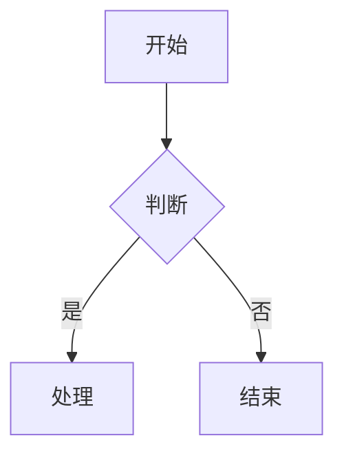
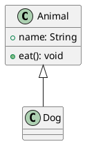

# Markdown 预览器

这是一个极简风格的 Markdown 文件预览工具，专为 GitHub Pages 设计，完全静态，无需后端。//**我已经没有精力去处理这一坨屎山代码了 我是怎么想到用原生 JS 去写的，有一个使用 react 重构的分支，但是我已经懒得去折腾了，反正是个人项目，就将就着用吧**
## 功能特点

- 📂 **自动发现** - 通过 GitHub API 自动扫描仓库中的所有 .md 文件
- 🌳 **树形文件结构** - 自动构建文档目录树
- 📱 **完美适配移动端** - 响应式设计，支持各种设备
- 🎨 **优雅设计** - 浅紫浅粉色系，极简风格
- ✨ **流畅动画** - 丝滑的加载和导航效果
- 🔒 **纯前端** - 无需后端或构建工具
- 🔍 **全文搜索** - 支持快速搜索所有文档内容
- ✏️ **编辑此页** - 悬浮 FAB 按钮，快速跳转 GitHub 编辑页面
- 🎯 **Hash 路由** - 每个文档有独特 URL，支持分享和书签
- 📋 **面包屑导航** - 显示当前文件路径，方便跳转
- 📝 **Frontmatter** - 支持 YAML 元数据解析
- ⏱️ **阅读时间估算** - 自动计算并显示文档的预计阅读时间
- 📢 **GitHub 风格 Alerts** - 支持 > [!NOTE]、> [!WARNING] 等警告提示语法
- 🖼️ **图片增强** - 图片懒加载、画廊模式、错误降级显示
- 🔗 **社交分享** - Open Graph 和 Twitter Card meta 标签，支持更好的分享预览
- 🔧 **调试模式** - 访问 `?debug=1` 时显示性能诊断面板
- ⚗️ **LaTeX 公式** - 支持 KaTeX 渲染数学公式
- 🏷️ **主题系统** - 7 种内置主题，支持自定义 CSS 主题
- 🔌 **插件系统** - 支持扩展自定义渲染器（如二维码生成）

## 主题系统

支持 7 种内置主题，一键切换：
- **默认** - 浅紫浅粉渐变
- **GitHub Light** - GitHub 明亮风格
- **GitHub Dark** - GitHub 深色风格
- **Notion** - Notion 暖灰风格
- **Arc Dark** - Arc 浏览器彩虹紫风格
- **Dracula** - Dracula 经典配色
- **Nord** - 北极光配色

**自定义主题**：在设置中输入自定义 CSS 文件 URL 即可。

## 文档目录结构

```
/
├── docs/
│   ├── getting-started.md       # 快速开始指南
│   ├── configuration.md         # 配置参考
│   ├── plugin-development.md    # 插件开发指南
│   ├── theme-customization.md   # 主题定制指南
│   ├── migration.md             # 迁移指南
│   ├── faq.md                   # 故障排查 FAQ
│   └── examples/                # 示例文档
│       ├── markdown-syntax.md   # Markdown 语法
│       ├── mermaid-examples.md  # Mermaid 图表
│       ├── plantuml-examples.md # PlantUML 图表
│       ├── latex-examples.md    # LaTeX 公式
│       ├── qrcode-examples.md   # 二维码示例
│       └── theme-demo.md        # 主题演示
└── README.md
```

## 快速开始

### GitHub Pages 部署（推荐）

1. **Fork 仓库**
2. **开启 GitHub Pages**
   - 在仓库 Settings 中点击 Pages
   - Source 选择 Deploy from a branch
3. **自定义配置**
   - 修改 `config.json` 中的 `owner` 和 `repo`（无需懂 JavaScript，编辑更安全！）
4. **推送代码后，GitHub Actions 会自动构建并部署**

### 本地预览

1. **克隆仓库**
2. **本地构建文件树**
   ```bash
   node scripts/build-file-tree.js
   ```
3. **用浏览器打开** `index.html`

## 配置

### 外部配置文件

所有配置都可以通过 `config.json` 文件进行自定义，无需修改 JavaScript 代码。如果 `config.json` 不存在，应用会使用内置的默认配置。

### 基础配置

修改 `config.json` 中的以下字段：

```json
{
  "owner": "your-username",
  "repo": "your-repo"
}
```

## 支持格式

### 基本 Markdown 格式
- 标题、段落、引用
- 列表、表格
- 粗体、斜体、删除线
- 代码块、行内代码
- 链接、图片
- 水平线

### GitHub 风格 Alerts

支持标准的 GitHub 警告提示语法，自动渲染为美观的提示框。

**支持类型**：
- `[!NOTE]` - 提示信息
- `[!TIP]` - 技巧提示
- `[!IMPORTANT]` - 重要提示
- `[!WARNING]` - 警告
- `[!CAUTION]` - 小心警告

**使用示例**：
```markdown
> [!NOTE]
> 这是一条提示信息

> [!WARNING]
> 这是一条警告信息
```

### 二维码生成

使用 `qrcode` 语言代码块生成二维码：

```qrcode
https://github.com
```

或使用配置格式：

```qrcode
{
  "data": "Hello, world!",
  "size": 200
}
```

### Mermaid 图表
支持 18+ 种图表类型：
- 流程图、时序图、类图
- 状态图、实体关系图、甘特图
- 饼图、Git 分支图、用户旅程图
- 思维导图、时间线图、四象限图
- 块图、C4 架构图、XY 图表
- 网络拓扑图、看板、需求图

使用示例：


### PlantUML 图表
支持多种图表类型：
- 类图、对象图、用例图
- 时序图、活动图、状态图
- 组件图、部署图、包图
- 通信图、定时图、交互概览图
- 思维导图、工作分解结构图
- 网络拓扑图、架构图
- 实体关系图、流程图
- JSON/XML 数据图、线框图
- 用户旅程图、需求图
- 时间线图、看板图
- 电路图、正则表达式图
- 数学公式图

使用示例：


### ApexCharts 交互式图表
支持现代化的交互式图表，使用 ApexCharts 库渲染：

**支持图表类型**：
- 折线图、面积图
- 柱状图、条形图
- 饼图、环形图
- 散点图、气泡图
- 雷达图
- 极坐标图
- 范围区域图
- 烛台图
- 瀑布图
- 进度条图

使用示例：
```apexcharts
{
  "chart": {"type": "line"},
  "series": [{"name": "销量", "data": [30, 40, 35, 50, 49, 60, 70]}],
  "xaxis": {"categories": ["周一", "周二", "周三", "周四", "周五", "周六", "周日"]}
}
```

### 乐谱渲染
支持多种乐谱格式渲染：

**支持格式**：
- ABC 记谱法 (abcjs)
- MEI/MusicXML (Verovio)
- MusicXML (OSMD - OpenSheetMusicDisplay)

使用示例（ABC记谱法）：
```abc
X:1
T:简单小星星
M:4/4
L:1/4
K:C
C C G G | A A G2 | F F E E | D D C2 |
```

### Git Diff 可视化
支持使用 diff2html 可视化展示 Git Diff 内容：

**使用示例**：
```diff
diff --git a/index.html b/index.html
index 1a2b3c4..5d6e7f8 100644
--- a/index.html
+++ b/index.html
@@ -10,7 +10,7 @@
   <title>My Project</title>
   <link rel="stylesheet" href="style.css">
-  <script src="old-lib.js"></script>
+  <script src="new-lib.js"></script>
 </head>
 <body>
   <h1>Hello World</h1>
```

### 外部服务嵌入

支持通过 iframe 嵌入多种外部服务：

**视频平台**：
- YouTube
- Bilibili
- Vimeo

**设计稿**：
- Figma
- Canva

**代码演示**：
- CodePen
- JSFiddle
- StackBlitz
- Replit

**地图**：
- Google Maps
- OpenStreetMap

**办公文档**：
- Google Docs/Sheets/Slides
- Office Online

**社交媒体**：
- Twitter/X 推文嵌入
- Twitter/X 时间线嵌入
- GitHub Gist

**徽章/状态**：
- Shields.io
- Badgen

使用示例：
```markdown
@[youtube](dQw4w9WgXcQ)
@[bilibili](BV1xx411c7mZ)
@[codepen](https://codepen.io/username/pen/example)
@[figma](https://www.figma.com/file/example)
@[twitter](https://twitter.com/username/status/1234567890)
@[x](https://x.com/username/status/1234567890)
```

### 地理数据可视化

支持嵌入 GeoJSON 和 TopoJSON 地理数据格式，使用 Leaflet.js 渲染交互式地图：

**支持格式**：
- GeoJSON（点、线、多边形等地理要素）
- TopoJSON（压缩的地理数据格式）

使用示例：
```markdown
@[geojson]({"type":"FeatureCollection","features":[{"type":"Feature","geometry":{"type":"Point","coordinates":[116.4074,39.9042]},"properties":{"name":"北京"}}]})

@[topojson]({"type":"Topology","objects":{"data":{"type":"GeometryCollection","geometries":[{"type":"Point","coordinates":[116.4074,39.9042]}]}},"arcs":[]})
```

### LaTeX 公式

使用 KaTeX 渲染数学公式，支持行内公式和块级公式。

**行内公式**：使用单个 `$` 包裹
```markdown
勾股定理：$a^2 + b^2 = c^2$
欧拉公式：$e^{i\pi} + 1 = 0$
```

**块级公式**：使用双 `$$` 包裹
```markdown
$$\int_{a}^{b} f(x) dx = F(b) - F(a)$$

$$\begin{pmatrix}
a & b \\
c & d
\end{pmatrix}$$
```

**支持的数学功能**：
- 基本运算：$+, -, \times, \div, =$
- 上下标：$x^2, a_1$
- 平方根：$\sqrt{x}$
- 求和积分：$\sum, \int, \prod$
- 矩阵：$\begin{pmatrix} ... \end{pmatrix}$
- 方程组：$\begin{cases} ... \end{cases}$
- 希腊字母：$\alpha, \beta, \gamma, \pi$
- 函数：$\sin, \cos, \log, \lim$

---

## 添加新文档

只需在仓库的任意位置添加 `.md` 文件，系统会自动发现并显示在侧边栏！

## 文件结构

你的仓库可以有任意的文件结构，所有 .md 文件都会被自动发现：

```
你的仓库/
├── index.html       # 主页面（必须在根目录）
├── css/             # 样式文件（模块化 CSS）
│   ├── base.css
│   ├── components.css
│   ├── floating.css
│   ├── layout.css
│   ├── markdown.css
│   ├── themes.css   # 主题系统
│   └── responsive.css
├── js/              # 核心模块目录（必须在根目录）
│   ├── config.js    # 配置文件
│   ├── state.js     # 状态管理
│   ├── dom.js       # DOM 引用
│   ├── ui.js        # UI 工具
│   ├── file-tree.js # 文件树功能
│   ├── markdown.js  # Markdown 渲染
│   ├── search.js    # 搜索功能
│   ├── router.js    # Hash 路由
│   ├── settings.js  # 设置面板
│   ├── themes/      # 主题管理器
│   │   └── theme-manager.js
│   └── renderers/   # 各种渲染器
│       ├── mermaid.js
│       ├── plantuml.js
│       ├── apexcharts.js
│       ├── music-notation.js
│       ├── diff.js
│       ├── geo.js
│       ├── embedded.js
│       └── katex.js
├── plugins/         # 插件目录
│   └── qrcode.js    # 二维码生成插件
├── README.md        # 你的文档
├── docs/            # 任意结构的文档目录
│   ├── guide.md
│   └── ...
└── any/             # 任意位置的文档
    └── file.md
```

---

## 代码示例

```javascript
const greeting = "Hello, World!";
console.log(greeting);
```

## 引用示例

> 这是一个引用示例
> 可以用来展示重要的文字内容

## 列表

- 第一项
- 第二项
- 第三项

## 表格

| 功能 | 描述 |
|------|------|
| 自动发现 | 通过 GitHub API 扫描所有 .md 文件 |
| 实时预览 | Markdown 即时渲染 |
| 响应式布局 | 支持各种屏幕尺寸 |
