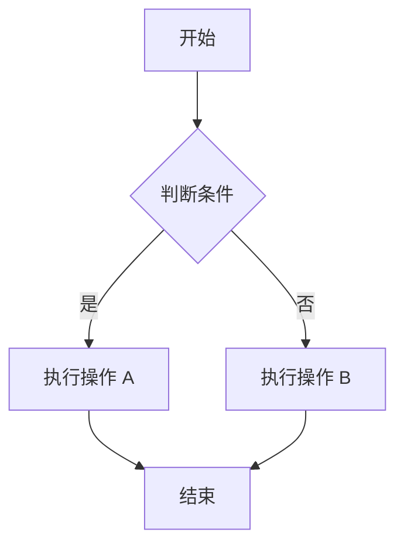
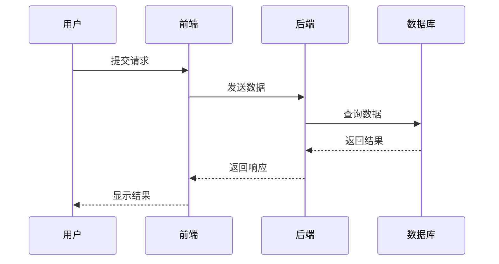
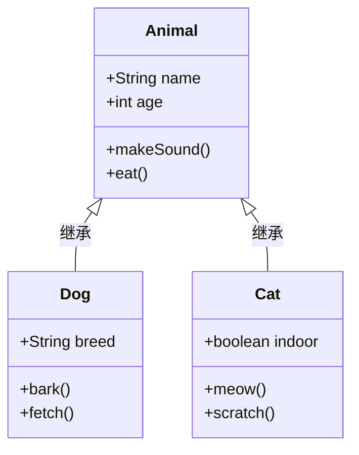
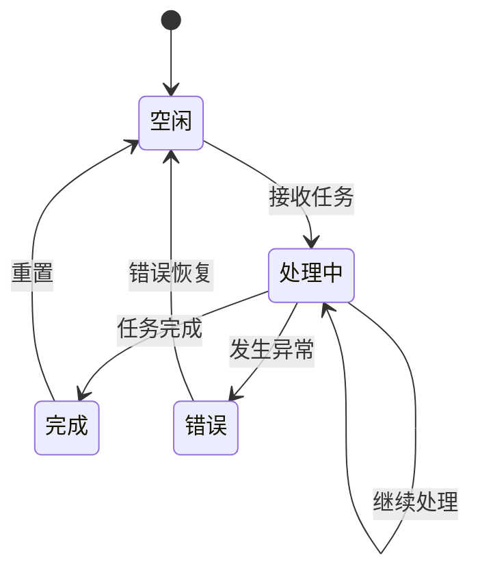
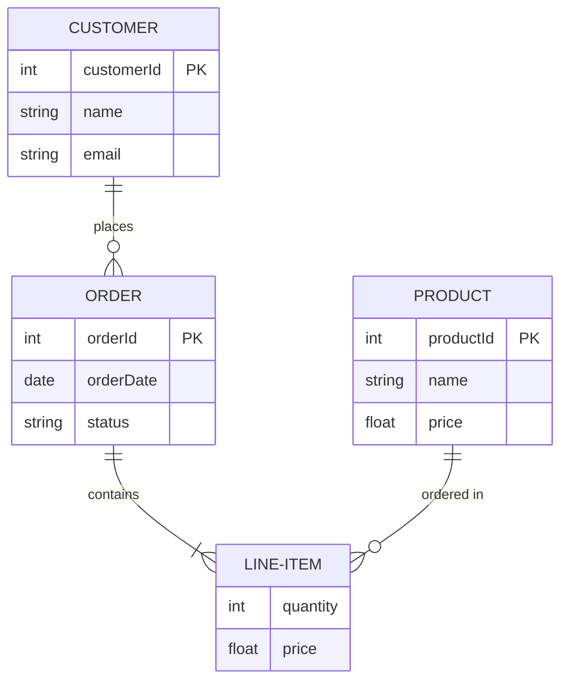
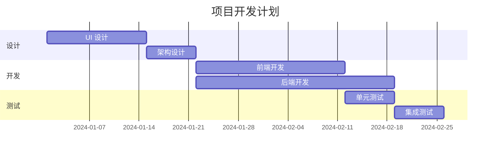
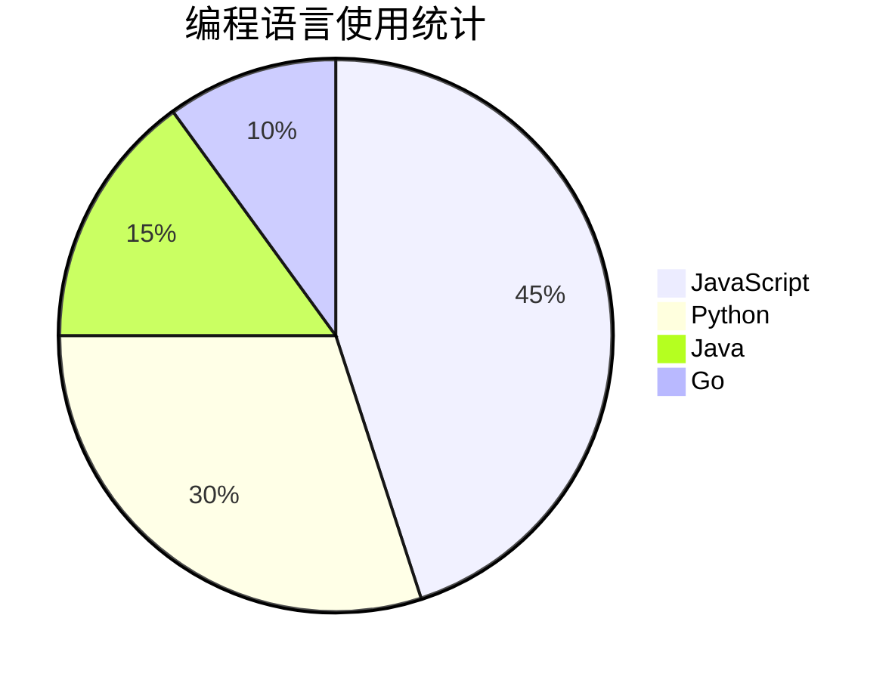
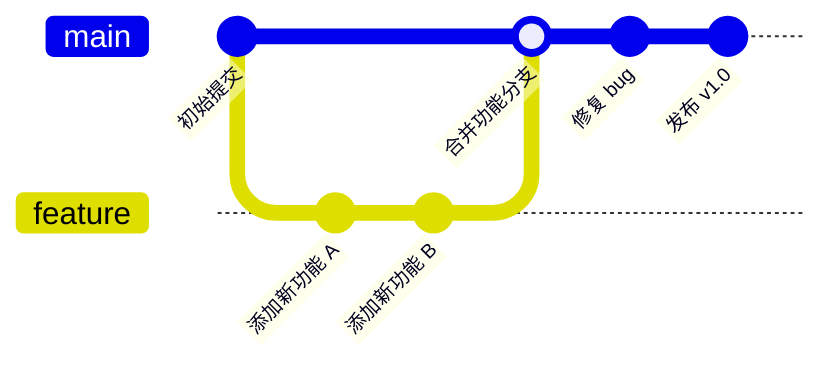
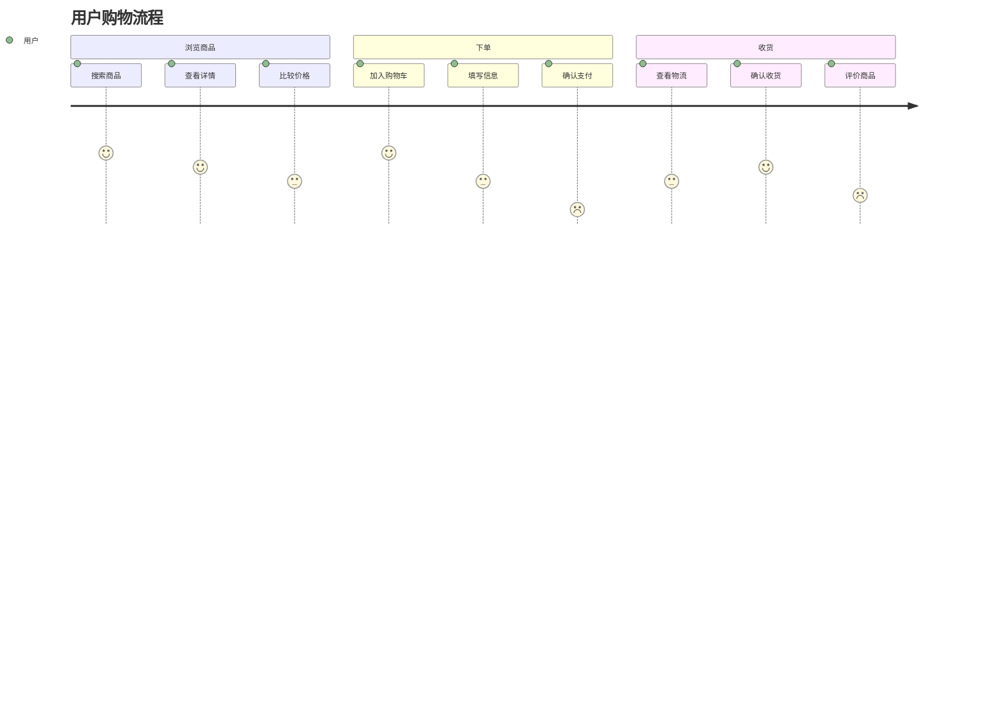
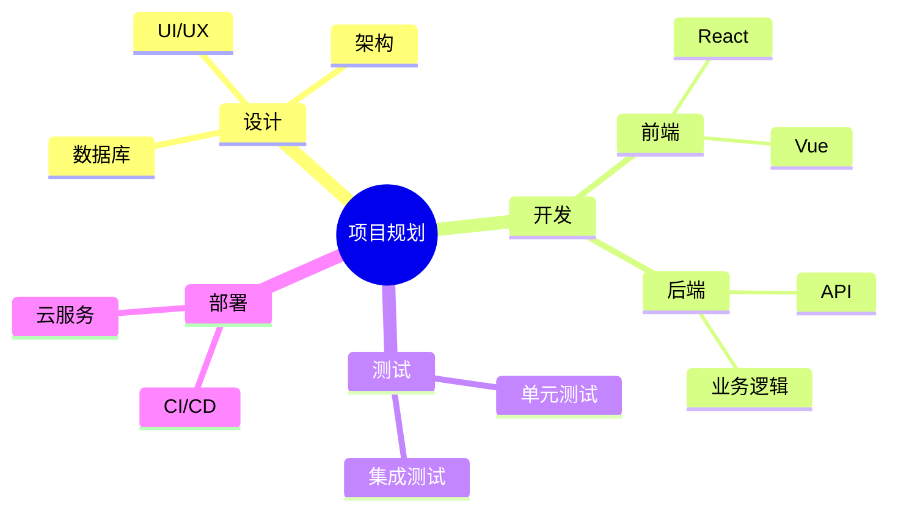

# Markdown 语法参考

本页面展示所有常用 Markdown 语法及其渲染效果。

---

## 标题

使用 `#` 符号创建标题，`#` 的数量表示标题级别。

```markdown
# 一级标题
## 二级标题
### 三级标题
#### 四级标题
##### 五级标题
###### 六级标题
```

**渲染效果：**

# 一级标题
## 二级标题
### 三级标题
#### 四级标题
##### 五级标题
###### 六级标题

---

## 强调

使用 `*` 或 `_` 表示斜体，`**` 或 `__` 表示粗体。

```markdown
*斜体文本*
_也是斜体_

**粗体文本**
__也是粗体__

***粗斜体文本***
___也是粗斜体___

~~删除线文本~~
```

**渲染效果：**

*斜体文本*
_也是斜体_

**粗体文本**
__也是粗体__

***粗斜体文本***
___也是粗斜体___

~~删除线文本~~

---

## 列表

### 无序列表

使用 `-`、`*` 或 `+` 创建无序列表，可以嵌套。

```markdown
- 项目一
- 项目二
  - 子项目 A
  - 子项目 B
- 项目三

* 也可以使用 *
+ 或使用 +
```

**渲染效果：**

- 项目一
- 项目二
  - 子项目 A
  - 子项目 B
- 项目三

* 也可以使用 *
+ 或使用 +

### 有序列表

使用数字加句点创建有序列表。

```markdown
1. 第一项
2. 第二项
3. 第三项
   1. 嵌套的有序列表
   2. 继续嵌套
4. 返回第一层级
```

**渲染效果：**

1. 第一项
2. 第二项
3. 第三项
   1. 嵌套的有序列表
   2. 继续嵌套
4. 返回第一层级

---

## 链接

使用 `[文本](URL)` 创建链接。

```markdown
[访问 Google](https://www.google.com)

[本地页面](../getting-started.md)

<https://www.example.com>
```

**渲染效果：**

[访问 Google](https://www.google.com)

[本地页面](../getting-started.md)

<https://www.example.com>

---

## 图片

使用 `` 插入图片。

```markdown


```

**渲染效果：**


---

## 引用

使用 `>` 创建引用块，可以嵌套。

```markdown
> 这是一个引用
> 可以多行
> 继续添加

> 第一层引用
>> 第二层嵌套引用
>>> 第三层嵌套
```

**渲染效果：**

> 这是一个引用
> 可以多行
> 继续添加

> 第一层引用
>> 第二层嵌套引用
>>> 第三层嵌套

---

## 代码

### 行内代码

使用反引号包裹代码片段。

```markdown
这是一段包含 `行内代码` 的文字。

使用 `console.log()` 输出日志。
```

**渲染效果：**

这是一段包含 `行内代码` 的文字。

使用 `console.log()` 输出日志。

### 代码块

使用三个反引号包裹代码块，可指定语言。

````markdown
```javascript
function hello() {
  console.log("Hello, World!");
}
```

```python
def hello():
    print("Hello, World!")
```

```html
<div class="container">
  <p>Hello</p>
</div>
```
````

**渲染效果：**

```javascript
function hello() {
  console.log("Hello, World!");
}
```

```python
def hello():
    print("Hello, World!")
```

```html
<div class="container">
  <p>Hello</p>
</div>
```

---

## 表格

使用管道符 `|` 和短横线 `-` 创建表格。

```markdown
| 左对齐 | 居中对齐 | 右对齐 |
|:-------|:--------:|------:|
| 单元格 | 单元格 | 单元格 |
| 数据一 | 数据二 | 数据三 |

| 功能 | 快捷键 | 说明 |
|------|--------|------|
| 保存 | Ctrl+S | 保存当前文件 |
| 复制 | Ctrl+C | 复制选中内容 |
```

**渲染效果：**

| 左对齐 | 居中对齐 | 右对齐 |
|:-------|:--------:|------:|
| 单元格 | 单元格 | 单元格 |
| 数据一 | 数据二 | 数据三 |

| 功能 | 快捷键 | 说明 |
|------|--------|------|
| 保存 | Ctrl+S | 保存当前文件 |
| 复制 | Ctrl+C | 复制选中内容 |

---

## 水平线

使用三个或更多的 `-`、`*`、`_` 创建水平线。

```markdown
---

***

___

- - - - -
```

**渲染效果：**

---

***

___

---

## 任务列表

使用 `- [ ]` 和 `- [x]` 创建复选框任务列表。

```markdown
- [x] 已完成的任务
- [ ] 未完成的任务
- [ ] 另一个待办事项
  - [x] 子任务已完成
  - [ ] 子任务待完成
```

**渲染效果：**

- [x] 已完成的任务
- [ ] 未完成的任务
- [ ] 另一个待办事项
  - [x] 子任务已完成
  - [ ] 子任务待完成

---

## 转义字符

使用 `\` 转义特殊字符，防止它们被解析为 Markdown 语法。

```markdown
\*不是斜体\*

\*\*不是粗体\*\*

\# 不是标题

\. 这是一个句点
```

**渲染效果：**

\*不是斜体\*

\*\*不是粗体\*\*

\# 不是标题

\. 这是一个句点

---

## 区块引用结合其他元素

引用块内可以使用其他 Markdown 语法。

```markdown
> **提示：** 这是一个包含加粗文本的引用
>
> - 引用中的列表
> - 第二项
>
> > 嵌套的引用
```

**渲染效果：**

> **提示：** 这是一个包含加粗文本的引用
>
> - 引用中的列表
> - 第二项
>
> > 嵌套的引用

---

## Mermaid 图表

使用 ` ```mermaid ` 代码块创建各种图表。所有图表都使用项目的淡紫罗兰色主题。

### 1. 流程图 (Flowchart)

使用 `flowchart` 或 `graph` 创建流程图。

````markdown

````

**渲染效果：**


### 2. 时序图 (Sequence Diagram)

使用 `sequenceDiagram` 创建时序图。

````markdown

````

**渲染效果：**


### 3. 类图 (Class Diagram)

使用 `classDiagram` 创建类图。

````markdown

````

**渲染效果：**


### 4. 状态图 (State Diagram)

使用 `stateDiagram` 创建状态图。

````markdown

````

**渲染效果：**


### 5. 实体关系图 (ER Diagram)

使用 `erDiagram` 创建 ER 图。

````markdown

````

**渲染效果：**


### 6. 甘特图 (Gantt Chart)

使用 `gantt` 创建甘特图。

````markdown

````

**渲染效果：**


### 7. 饼图 (Pie Chart)

使用 `pie` 创建饼图。

````markdown

````

**渲染效果：**


### 8. Git 分支图 (Git Graph)

使用 `gitGraph` 创建 Git 分支图。

````markdown

````

**渲染效果：**


### 9. 用户旅程图 (User Journey)

使用 `journey` 创建用户旅程图。

````markdown

````

**渲染效果：**


### 10. 思维导图 (Mind Map)

使用 `mindmap` 创建思维导图。

````markdown

````

**渲染效果：**


### 11. 时间线图 (Timeline)

使用 `timeline` 创建时间线图。

````markdown
```mermaid
timeline
    title 技术发展历程
    2000-2010 : 互联网兴起
        Web 1.0 时代
        静态网页
    2010-2020 : 移动互联网
        智能手机普及
        社交媒体兴起
    2020-至今 : AI 时代
        大语言模型
        AI 应用爆发
```
````

**渲染效果：**

```mermaid
timeline
    title 技术发展历程
    2000-2010 : 互联网兴起
        Web 1.0 时代
        静态网页
    2010-2020 : 移动互联网
        智能手机普及
        社交媒体兴起
    2020-至今 : AI 时代
        大语言模型
        AI 应用爆发
```

### 12. 四象限图 (Quadrant Chart)

使用 `quadrantChart` 创建四象限图。

````markdown
```mermaid
quadrantChart
    title 项目优先级矩阵
    x-axis 低成本 --> 高成本
    y-axis 低价值 --> 高价值
    quadrant-1 重点投入
    quadrant-2 规划发展
    quadrant-3 可以放弃
    quadrant-4 维持现状
    功能 A: [0.3, 0.6]
    功能 B: [0.7, 0.8]
    功能 C: [0.2, 0.3]
    功能 D: [0.8, 0.4]
```
````

**渲染效果：**

```mermaid
quadrantChart
    title 项目优先级矩阵
    x-axis 低成本 --> 高成本
    y-axis 低价值 --> 高价值
    quadrant-1 重点投入
    quadrant-2 规划发展
    quadrant-3 可以放弃
    quadrant-4 维持现状
    功能 A: [0.3, 0.6]
    功能 B: [0.7, 0.8]
    功能 C: [0.2, 0.3]
    功能 D: [0.8, 0.4]
```

### 13. 块图 (Block Diagram)

使用 `block` 创建块图。

````markdown
```mermaid
block-beta
    columns 3
    
    title: 系统架构图
    
    web: 客户端
    app: 应用服务
    db: 数据库
    
    web --> app
    app --> db
    app --> app: 缓存
```
````

**渲染效果：**

```mermaid
block-beta
    columns 3
    
    title: 系统架构图
    
    web: 客户端
    app: 应用服务
    db: 数据库
    
    web --> app
    app --> db
    app --> app: 缓存
```

### 14. 架构图 (Architecture Diagram)

使用 `C4Context` 创建 C4 架构图。

````markdown
```mermaid
C4Context
    title 系统上下文
    
    Person(user, "用户", "使用系统的人")
    System(web, "Web 应用", "提供用户界面")
    SystemDb(database, "数据库", "存储数据")
    
    Rel(user, web, "使用")
    Rel(web, database, "读写数据")
```
````

**渲染效果：**

```mermaid
C4Context
    title 系统上下文
    
    Person(user, "用户", "使用系统的人")
    System(web, "Web 应用", "提供用户界面")
    SystemDb(database, "数据库", "存储数据")
    
    Rel(user, web, "使用")
    Rel(web, database, "读写数据")
```

### 15. 甜甜圈图 (Donut Chart)

````markdown
```mermaid
pie title 项目预算分配
    "人力资源" : 50
    "基础设施" : 25
    "市场营销" : 15
    "研发工具" : 10
```
````

**渲染效果：**

```mermaid
pie title 项目预算分配
    "人力资源" : 50
    "基础设施" : 25
    "市场营销" : 15
    "研发工具" : 10
```

### 16. XY 图表 (XY Chart)

使用 `xychart` 创建 XY 图表。

````markdown
```mermaid
xychart-beta
    title "销售额 vs 成本"
    x-axis [1月, 2月, 3月, 4月, 5月]
    y-axis "金额 (万元)" 0 --> 100
    line [30, 45, 42, 55, 70]
```
````

**渲染效果：**

```mermaid
xychart-beta
    title "销售额 vs 成本"
    x-axis [1月, 2月, 3月, 4月, 5月]
    y-axis "金额 (万元)" 0 --> 100
    line [30, 45, 42, 55, 70]
```

### 17. 网络拓扑图 (使用流程图)

````markdown
```mermaid
flowchart LR
    subgraph Internet[互联网]
        Client1([用户 A])
        Client2([用户 B])
    end
    
    subgraph Cloud[云服务]
        LoadBalancer{负载均衡}
        Server1[服务器 1]
        Server2[服务器 2]
    end
    
    subgraph Database[数据层]
        DB1[(主数据库)]
        DB2[(备份数据库)]
    end
    
    Client1 --> LoadBalancer
    Client2 --> LoadBalancer
    LoadBalancer --> Server1
    LoadBalancer --> Server2
    Server1 --> DB1
    Server2 --> DB2
    DB1 <--> DB2
```
````

**渲染效果：**

```mermaid
flowchart LR
    subgraph Internet[互联网]
        Client1([用户 A])
        Client2([用户 B])
    end
    
    subgraph Cloud[云服务]
        LoadBalancer{负载均衡}
        Server1[服务器 1]
        Server2[服务器 2]
    end
    
    subgraph Database[数据层]
        DB1[(主数据库)]
        DB2[(备份数据库)]
    end
    
    Client1 --> LoadBalancer
    Client2 --> LoadBalancer
    LoadBalancer --> Server1
    LoadBalancer --> Server2
    Server1 --> DB1
    Server2 --> DB2
    DB1 <--> DB2
```

### 18. 看板 (Kanban - 使用流程图)

````markdown
```mermaid
flowchart LR
    subgraph Backlog[待办]
        B1["📋 任务 1"]
        B2["📋 任务 2"]
    end
    
    subgraph InProgress[进行中]
        P1["🔄 任务 3"]
    end
    
    subgraph Review[审核中]
        R1["👀 任务 4"]
    end
    
    subgraph Done[已完成]
        D1["✅ 任务 5"]
        D2["✅ 任务 6"]
    end
    
    B1 --> P1
    B2 --> P1
    P1 --> R1
    R1 --> D1
    D1 --> D2
```
````

**渲染效果：**

```mermaid
flowchart LR
    subgraph Backlog[待办]
        B1["📋 任务 1"]
        B2["📋 任务 2"]
    end
    
    subgraph InProgress[进行中]
        P1["🔄 任务 3"]
    end
    
    subgraph Review[审核中]
        R1["👀 任务 4"]
    end
    
    subgraph Done[已完成]
        D1["✅ 任务 5"]
        D2["✅ 任务 6"]
    end
    
    B1 --> P1
    B2 --> P1
    P1 --> R1
    R1 --> D1
    D1 --> D2
```

---

如需更多信息，请参考 [CommonMark 规范](https://commonmark.org/) 和 [Mermaid 官方文档](https://mermaid.js.org/)。
