# Mermaid 图表示例

本文档展示了 Mermaid 支持的各类图表及其渲染效果。

---

## 1. 流程图 (Flowchart)

### 垂直流程图 (Top to Bottom)

```txt
flowchart TD
    A[开始] --> B{条件判断}
    B -->|是| C[执行操作 A]
    B -->|否| D[执行操作 B]
    C --> E[结束]
    D --> E
```


**渲染效果：**

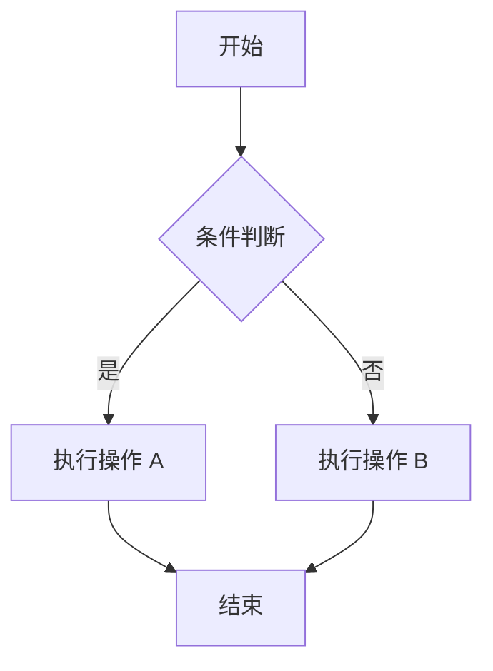
```mermaid
flowchart TD
    A[开始] --> B{条件判断}
    B -->|是| C[执行操作 A]
    B -->|否| D[执行操作 B]
    C --> E[结束]
    D --> E
```

### 水平流程图 (Left to Right)

```txt
flowchart LR
    A[用户输入] --> B[验证]
    B --> C{有效?}
    C -->|是| D[处理]
    C -->|否| E[提示错误]
    D --> F[保存结果]
```

**渲染效果：**

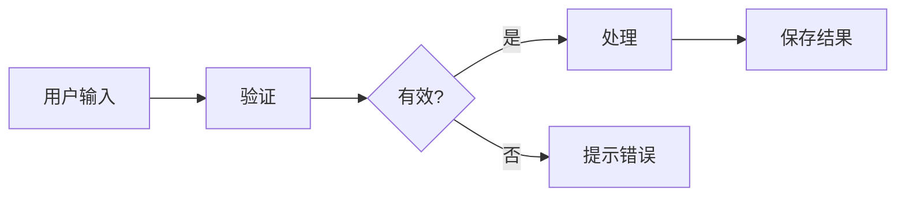
```mermaid
flowchart LR
    A[用户输入] --> B[验证]
    B --> C{有效?}
    C -->|是| D[处理]
    C -->|否| E[提示错误]
    D --> F[保存结果]
```

### 复杂流程图 (包含子图)

```txt
flowchart TB
    subgraph Frontend
        A[Web 页面]
        B[客户端逻辑]
    end
    
    subgraph Backend
        C[API 服务]
        D[业务逻辑]
    end
    
    subgraph Database
        E[(主数据库)]
        F[(缓存)]
    end
    
    A --> B
    B --> C
    C --> D
    D --> E
    D <--> F
```

**渲染效果：**

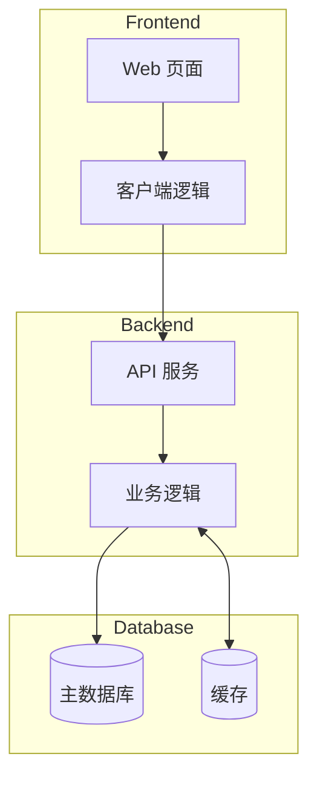
```mermaid
flowchart TB
    subgraph Frontend
        A[Web 页面]
        B[客户端逻辑]
    end
    
    subgraph Backend
        C[API 服务]
        D[业务逻辑]
    end
    
    subgraph Database
        E[(主数据库)]
        F[(缓存)]
    end
    
    A --> B
    B --> C
    C --> D
    D --> E
    D <--> F
```

---

## 2. 时序图 (Sequence Diagram)

### 基础时序图

```txt
sequenceDiagram
    participant User
    participant Client
    participant Server
    participant DB
    
    User->>Client: 点击提交
    Client->>Server: 发送请求
    activate Server
    Server->>DB: 查询数据
    activate DB
    DB-->>Server: 返回结果
    deactivate DB
    Server-->>Client: 响应成功
    deactivate Server
    Client-->>User: 显示结果
```

**渲染效果：**

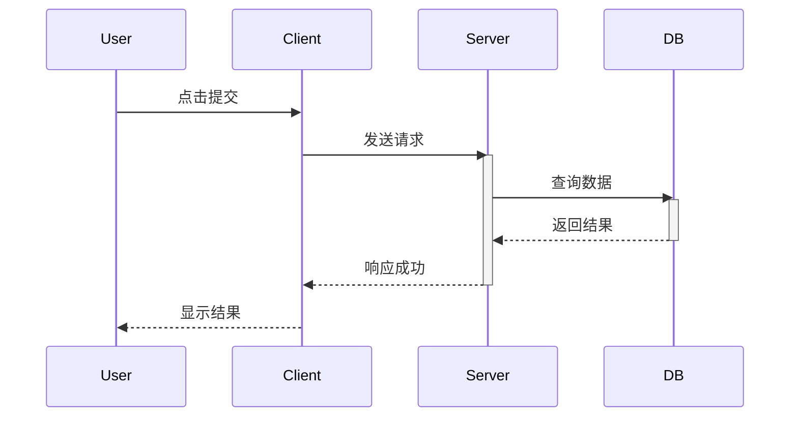
```mermaid
sequenceDiagram
    participant User
    participant Client
    participant Server
    participant DB
    
    User->>Client: 点击提交
    Client->>Server: 发送请求
    activate Server
    Server->>DB: 查询数据
    activate DB
    DB-->>Server: 返回结果
    deactivate DB
    Server-->>Client: 响应成功
    deactivate Server
    Client-->>User: 显示结果
```

### 循环与条件

```txt
sequenceDiagram
    User->>App: 请求分页数据
    loop 每一页
        App->>API: GET /items?page=n
        API->>DB: SELECT * LIMIT 10 OFFSET n*10
        DB-->>API: 10条记录
        API-->>App: 数据 + total
        App-->>User: 显示第n页
    end
```

**渲染效果：**

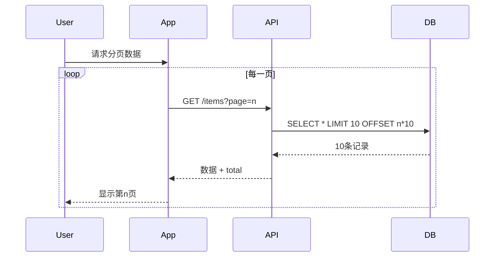
```mermaid
sequenceDiagram
    User->>App: 请求分页数据
    loop 每一页
        App->>API: GET /items?page=n
        API->>DB: SELECT * LIMIT 10 OFFSET n*10
        DB-->>API: 10条记录
        API-->>App: 数据 + total
        App-->>User: 显示第n页
    end
```

---

## 3. 类图 (Class Diagram)

### 基础类图

```txt
classDiagram
    class Animal {
        +String name
        +int age
        +makeSound()
        +eat()
    }
    class Dog {
        +String breed
        +bark()
        +fetch()
    }
    class Cat {
        +boolean indoor
        +meow()
        +scratch()
    }
    
    Animal <|-- Dog : 继承
    Animal <|-- Cat : 继承
```

**渲染效果：**

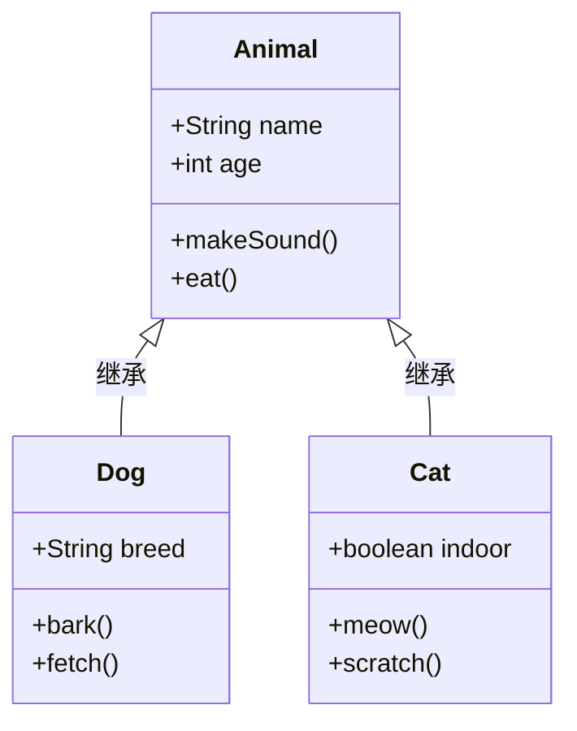
```mermaid
classDiagram
    class Animal {
        +String name
        +int age
        +makeSound()
        +eat()
    }
    class Dog {
        +String breed
        +bark()
        +fetch()
    }
    class Cat {
        +boolean indoor
        +meow()
        +scratch()
    }
    
    Animal <|-- Dog : 继承
    Animal <|-- Cat : 继承
```

### 复杂类关系

```txt
classDiagram
    class User {
        +String id
        +String name
        +String email
        +login()
        +logout()
    }
    
    class Order {
        +String id
        +Date orderDate
        +Status status
        +totalAmount()
    }
    
    class Product {
        +String id
        +String name
        +float price
        +int stock
    }
    
    class OrderItem {
        +int quantity
        +float price
    }
    
    User "1" --> "*" Order : 创建
    Order "1" --> "*" OrderItem : 包含
    OrderItem "*" --> "1" Product : 对应
```

**渲染效果：**

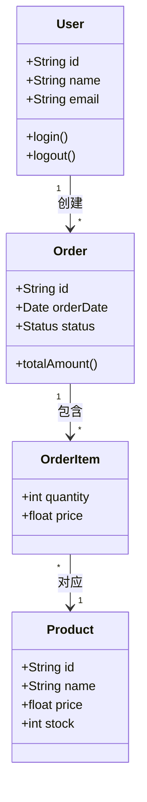
```mermaid
classDiagram
    class User {
        +String id
        +String name
        +String email
        +login()
        +logout()
    }
    
    class Order {
        +String id
        +Date orderDate
        +Status status
        +totalAmount()
    }
    
    class Product {
        +String id
        +String name
        +float price
        +int stock
    }
    
    class OrderItem {
        +int quantity
        +float price
    }
    
    User "1" --> "*" Order : 创建
    Order "1" --> "*" OrderItem : 包含
    OrderItem "*" --> "1" Product : 对应
```

---

## 4. 状态图 (State Diagram)

### 基础状态图

```txt
stateDiagram-v2
    [*] --> 草稿
    草稿 --> 审核中: 提交审核
    审核中 --> 已发布: 审核通过
    审核中 --> 已拒绝: 审核不通过
    已拒绝 --> 草稿: 修改后重提
    已发布 --> [*]
```

**渲染效果：**

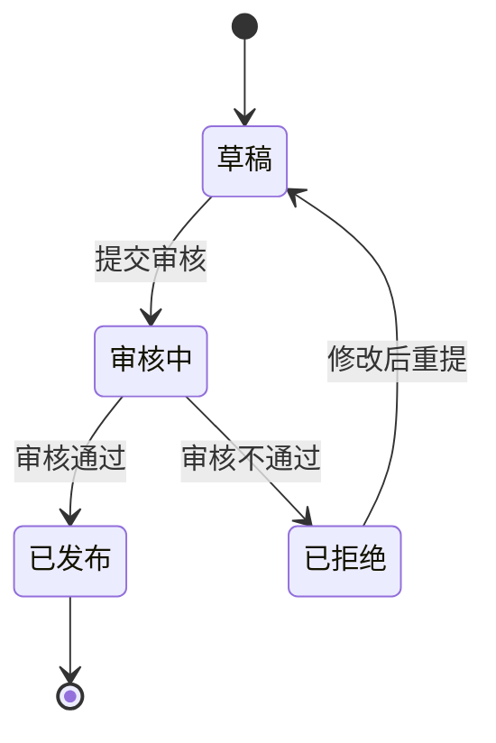
```mermaid
stateDiagram-v2
    [*] --> 草稿
    草稿 --> 审核中: 提交审核
    审核中 --> 已发布: 审核通过
    审核中 --> 已拒绝: 审核不通过
    已拒绝 --> 草稿: 修改后重提
    已发布 --> [*]
```

### 带选择的状态图

```txt
stateDiagram-v2
    [*] --> 空闲
    
    state 空闲 {
        [*] --> 等待
        等待 --> 处理中: 收到任务
        处理中 --> 等待: 任务完成
    }
    
    空闲 --> 错误: 异常发生
    错误 --> 空闲: 恢复
    错误 --> [*]
```

**渲染效果：**

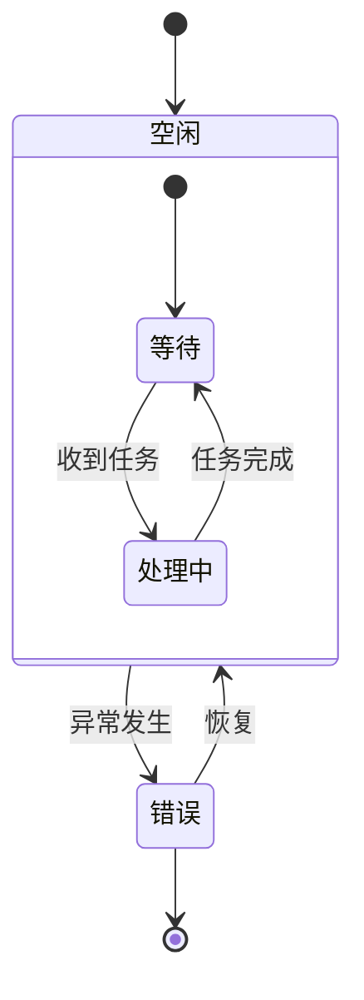
```mermaid
stateDiagram-v2
    [*] --> 空闲
    
    state 空闲 {
        [*] --> 等待
        等待 --> 处理中: 收到任务
        处理中 --> 等待: 任务完成
    }
    
    空闲 --> 错误: 异常发生
    错误 --> 空闲: 恢复
    错误 --> [*]
```

---

## 5. 实体关系图 (ER Diagram)

### 基础 ER 图

```txt
erDiagram
    CUSTOMER ||--o{ ORDER : places
    ORDER ||--|{ LINE-ITEM : contains
    PRODUCT ||--o{ LINE-ITEM : "ordered in"
    CUSTOMER {
        int customerId PK
        string name
        string email
        date registerDate
    }
    ORDER {
        int orderId PK
        date orderDate
        string status
        float totalAmount
    }
    LINE-ITEM {
        int quantity
        float unitPrice
        float subtotal
    }
    PRODUCT {
        int productId PK
        string name
        float price
        int stock
    }
```

**渲染效果：**

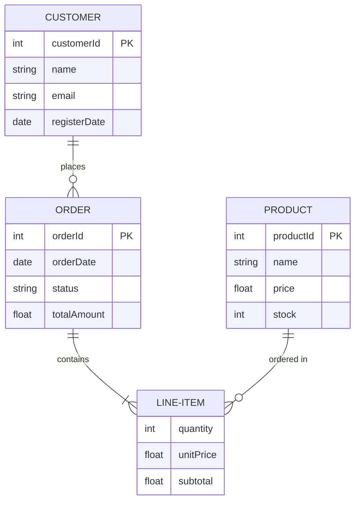
```mermaid
erDiagram
    CUSTOMER ||--o{ ORDER : places
    ORDER ||--|{ LINE-ITEM : contains
    PRODUCT ||--o{ LINE-ITEM : "ordered in"
    CUSTOMER {
        int customerId PK
        string name
        string email
        date registerDate
    }
    ORDER {
        int orderId PK
        date orderDate
        string status
        float totalAmount
    }
    LINE-ITEM {
        int quantity
        float unitPrice
        float subtotal
    }
    PRODUCT {
        int productId PK
        string name
        float price
        int stock
    }
```

---

## 6. 甘特图 (Gantt Chart)

### 项目计划甘特图

```txt
gantt
    title 项目开发计划
    dateFormat  YYYY-MM-DD
    excludes    weekends
    section 设计
    需求分析       :a1, 2024-01-01, 10d
    UI设计         :a2, after a1, 14d
    架构设计       :a3, after a2, 7d
    section 开发
    后端开发       :b1, after a3, 28d
    前端开发       :b2, after a3, 21d
    section 测试
    单元测试       :c1, after b1, 7d
    集成测试       :c2, after b1 b2, 7d
    系统测试       :c3, after c2, 5d
    section 部署
    预发布         :d1, after c3, 3d
    正式发布       :d2, after d1, 2d
```

**渲染效果：**

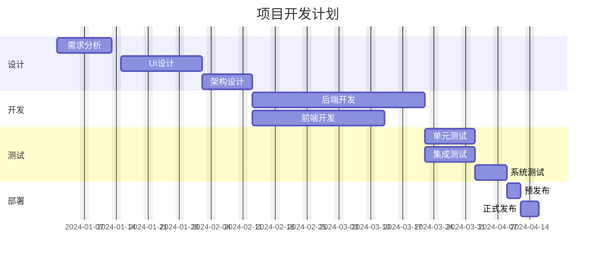
```mermaid
gantt
    title 项目开发计划
    dateFormat  YYYY-MM-DD
    excludes    weekends
    section 设计
    需求分析       :a1, 2024-01-01, 10d
    UI设计         :a2, after a1, 14d
    架构设计       :a3, after a2, 7d
    section 开发
    后端开发       :b1, after a3, 28d
    前端开发       :b2, after a3, 21d
    section 测试
    单元测试       :c1, after b1, 7d
    集成测试       :c2, after b1 b2, 7d
    系统测试       :c3, after c2, 5d
    section 部署
    预发布         :d1, after c3, 3d
    正式发布       :d2, after d1, 2d
```

---

## 7. 饼图 (Pie Chart) & 甜甜圈图 (Donut Chart)

### 饼图

```txt
pie title 编程语言使用统计
    "JavaScript" : 45
    "Python" : 30
    "Java" : 15
    "Go" : 10
```

**渲染效果：**

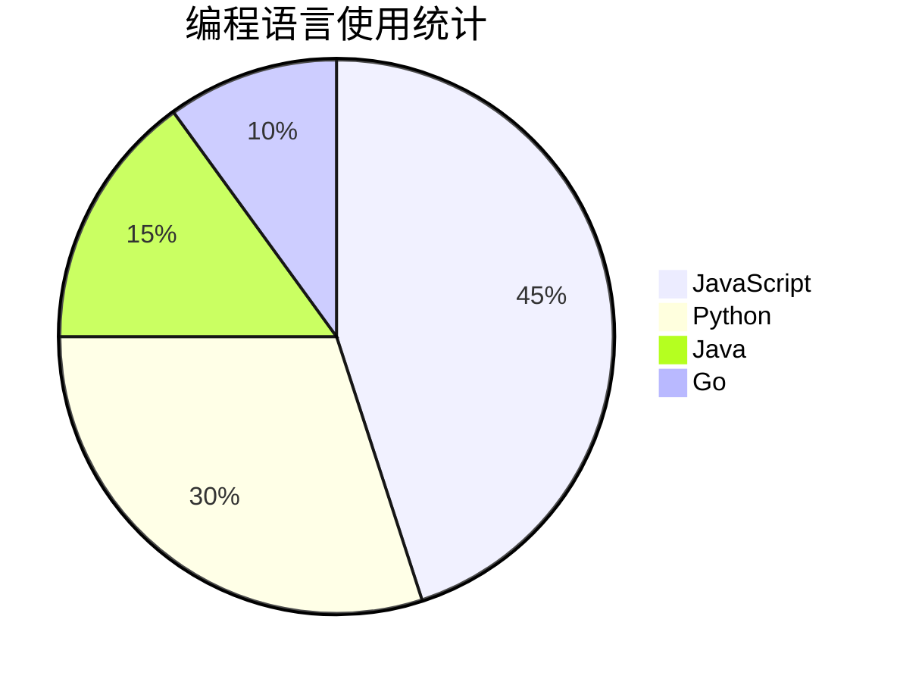
```mermaid
pie title 编程语言使用统计
    "JavaScript" : 45
    "Python" : 30
    "Java" : 15
    "Go" : 10
```

### 预算分配 (甜甜圈图效果)

```txt
pie title 项目预算分配
    "人力资源" : 50
    "基础设施" : 25
    "市场营销" : 15
    "研发工具" : 10
```

**渲染效果：**

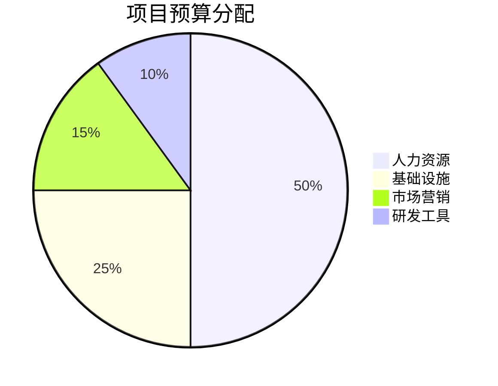
```mermaid
pie title 项目预算分配
    "人力资源" : 50
    "基础设施" : 25
    "市场营销" : 15
    "研发工具" : 10
```

---

## 8. Git 分支图 (Git Graph)

### 基础 Git 分支图

```txt
gitGraph
    commit id: "Initial commit"
    branch feature/login
    checkout feature/login
    commit id: "Add login page"
    commit id: "Implement login logic"
    checkout main
    merge feature/login id: "Merge login feature"
    commit id: "Fix bug #123"
    branch hotfix
    checkout hotfix
    commit id: "Fix critical issue"
    checkout main
    merge hotfix id: "Apply hotfix"
    commit id: "Release v1.0"
```

**渲染效果：**

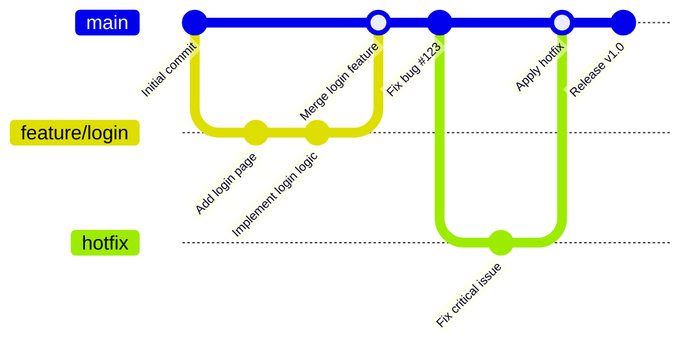
```mermaid
gitGraph
    commit id: "Initial commit"
    branch feature/login
    checkout feature/login
    commit id: "Add login page"
    commit id: "Implement login logic"
    checkout main
    merge feature/login id: "Merge login feature"
    commit id: "Fix bug #123"
    branch hotfix
    checkout hotfix
    commit id: "Fix critical issue"
    checkout main
    merge hotfix id: "Apply hotfix"
    commit id: "Release v1.0"
```

---

## 9. 用户旅程图 (User Journey)

### 购物流程用户旅程

```txt
journey
    title 用户购物流程
    section 浏览商品
      搜索商品: 5: 用户
      查看详情: 4: 用户
      比较价格: 3: 用户
    section 下单
      加入购物车: 5: 用户
      填写收货信息: 3: 用户
      选择支付方式: 4: 用户
      确认支付: 1: 用户
    section 收货
      查看物流: 3: 用户
      确认收货: 4: 用户
      评价商品: 2: 用户
    section 售后
      申请退换: 1: 用户
      客服处理: 3: 客服
      完成退换: 4: 用户
```

**渲染效果：**

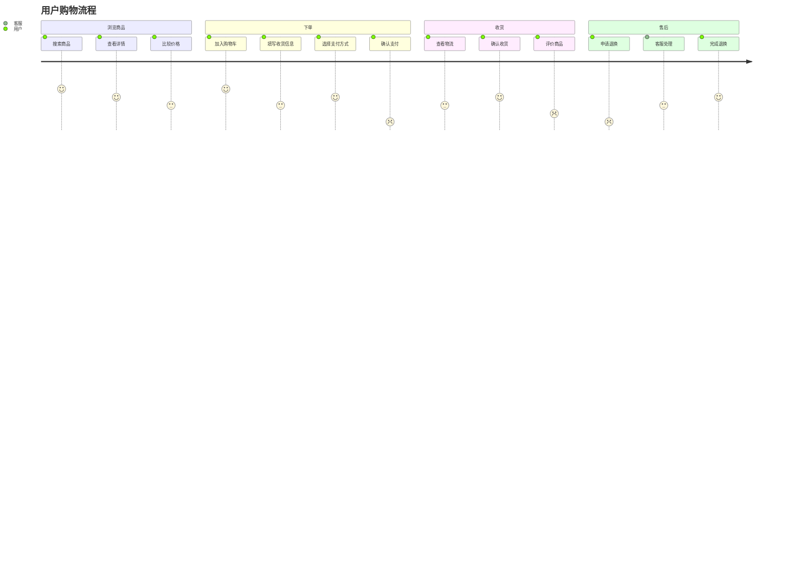
```mermaid
journey
    title 用户购物流程
    section 浏览商品
      搜索商品: 5: 用户
      查看详情: 4: 用户
      比较价格: 3: 用户
    section 下单
      加入购物车: 5: 用户
      填写收货信息: 3: 用户
      选择支付方式: 4: 用户
      确认支付: 1: 用户
    section 收货
      查看物流: 3: 用户
      确认收货: 4: 用户
      评价商品: 2: 用户
    section 售后
      申请退换: 1: 用户
      客服处理: 3: 客服
      完成退换: 4: 用户
```

---

## 10. 思维导图 (Mind Map)

### 项目规划思维导图

```txt
mindmap
  root((项目规划))
    设计阶段
      需求分析
        功能需求
        非功能需求
      UI/UX设计
        原型设计
        视觉设计
      架构设计
        系统架构
        数据库设计
    开发阶段
      后端开发
        API接口
        业务逻辑
        数据访问
      前端开发
        页面开发
        组件开发
        交互开发
    测试阶段
      单元测试
      集成测试
      系统测试
      用户验收测试
    部署阶段
      环境准备
      部署执行
      监控运维
```

**渲染效果：**

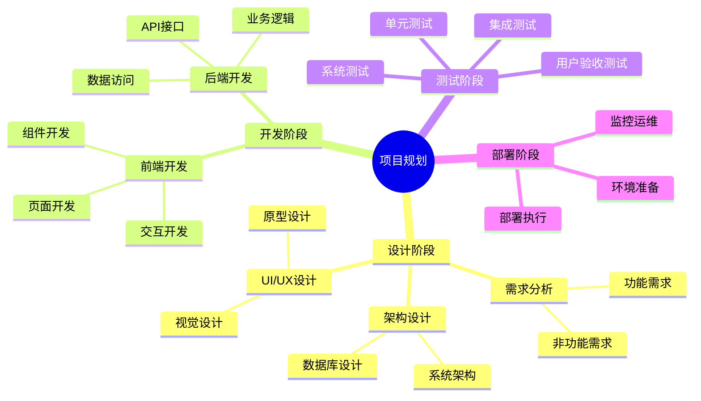
```mermaid
mindmap
  root((项目规划))
    设计阶段
      需求分析
        功能需求
        非功能需求
      UI/UX设计
        原型设计
        视觉设计
      架构设计
        系统架构
        数据库设计
    开发阶段
      后端开发
        API接口
        业务逻辑
        数据访问
      前端开发
        页面开发
        组件开发
        交互开发
    测试阶段
      单元测试
      集成测试
      系统测试
      用户验收测试
    部署阶段
      环境准备
      部署执行
      监控运维
```

---

## 11. 时间线图 (Timeline)

### 技术发展时间线

```txt
timeline
    title 技术发展历程
    2000-2010 : Web 1.0 时代
        静态网页
        表格布局
        IE 浏览器主导
    2010-2015 : Web 2.0 时代
        动态网页
        Ajax 技术
        jQuery 流行
    2015-2020 : 移动互联网时代
        智能手机普及
        响应式设计
        Vue / React 框架
    2020-至今 : AI 时代
        大语言模型
        智能应用
        云原生技术
```

**渲染效果：**

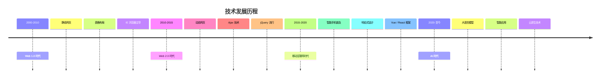
```mermaid
timeline
    title 技术发展历程
    2000-2010 : Web 1.0 时代
        静态网页
        表格布局
        IE 浏览器主导
    2010-2015 : Web 2.0 时代
        动态网页
        Ajax 技术
        jQuery 流行
    2015-2020 : 移动互联网时代
        智能手机普及
        响应式设计
        Vue / React 框架
    2020-至今 : AI 时代
        大语言模型
        智能应用
        云原生技术
```

---

## 12. 四象限图 (Quadrant Chart)

### 项目优先级矩阵

```txt
quadrantChart
    title 项目优先级矩阵
    x-axis 低影响 --> 高影响
    y-axis 低成本 --> 高成本
    quadrant-1 立即执行
    quadrant-2 重点规划
    quadrant-3 暂缓考虑
    quadrant-4 审慎评估
    功能A: [0.30, 0.60]
    功能B: [0.70, 0.80]
    功能C: [0.20, 0.30]
    功能D: [0.80, 0.40]
    功能E: [0.50, 0.50]
```

**渲染效果：**

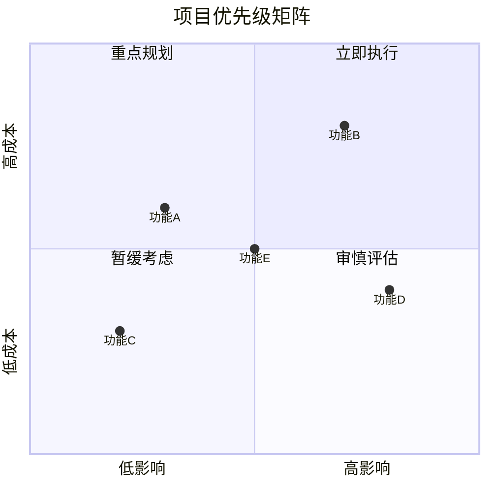
```mermaid
quadrantChart
    title 项目优先级矩阵
    x-axis 低影响 --> 高影响
    y-axis 低成本 --> 高成本
    quadrant-1 立即执行
    quadrant-2 重点规划
    quadrant-3 暂缓考虑
    quadrant-4 审慎评估
    功能A: [0.30, 0.60]
    功能B: [0.70, 0.80]
    功能C: [0.20, 0.30]
    功能D: [0.80, 0.40]
    功能E: [0.50, 0.50]
```

---

## 13. 块图 (Block Diagram)

### 系统架构块图

```txt
block
    columns 3
    web["客户端"]
    app["应用服务"]
    cache["缓存"]

    db[("数据库")]
    queue["消息队列"]

    web --> app
    app --> cache
    app --> db
    app --> queue
```

**渲染效果：**

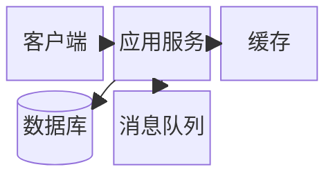
```mermaid
block
    columns 3
    web["客户端"]
    app["应用服务"]
    cache["缓存"]

    db[("数据库")]
    queue["消息队列"]

    web --> app
    app --> cache
    app --> db
    app --> queue
```

---

## 14. C4 架构图 (C4 Model)

### C4 系统上下文图

```txt
C4Context
    title 系统上下文图
    
    Person(user, "用户", "使用系统的人员")
    System(web, "Web 应用", "提供用户界面和交互")
    System(api, "API 服务", "处理业务逻辑")
    SystemDb(database, "数据库", "存储业务数据")
    
    Rel(user, web, "使用浏览器访问")
    Rel(web, api, "调用 API")
    Rel(api, database, "读写数据")
```

**渲染效果：**

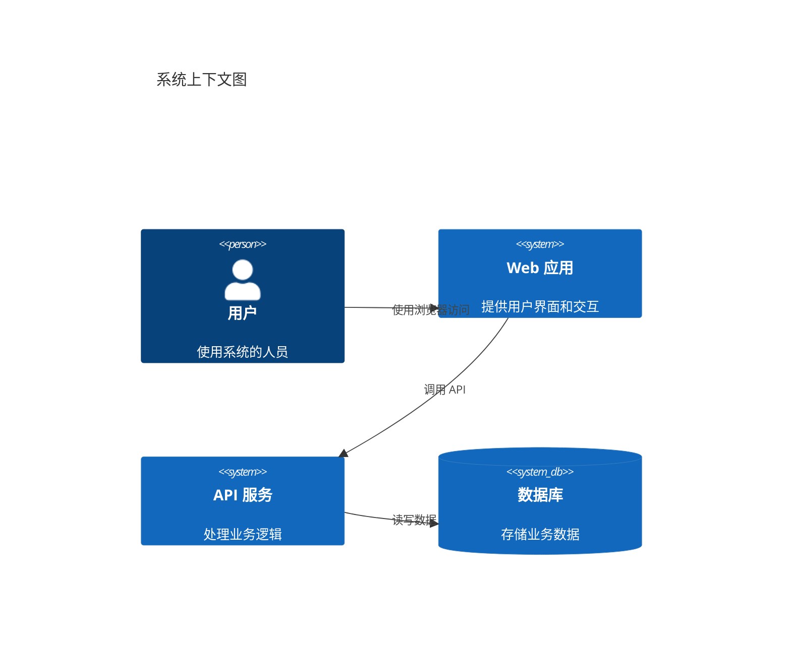
```mermaid
C4Context
    title 系统上下文图
    
    Person(user, "用户", "使用系统的人员")
    System(web, "Web 应用", "提供用户界面和交互")
    System(api, "API 服务", "处理业务逻辑")
    SystemDb(database, "数据库", "存储业务数据")
    
    Rel(user, web, "使用浏览器访问")
    Rel(web, api, "调用 API")
    Rel(api, database, "读写数据")
```

---

## 15. XY 图表 (XY Chart)

### 销售数据趋势图

```txt
xychart-beta horizontal
    title "Quarterly Report"
    x-axis [Q1, Q2, Q3, Q4]
    y-axis "Revenue (k$)" 0 --> 100
    bar [65, 59, 80, 81]
    line [60, 55, 75, 85]

```

**渲染效果：**

```mermaid
xychart-beta horizontal
    title "Quarterly Report"
    x-axis [Q1, Q2, Q3, Q4]
    y-axis "Revenue (k$)" 0 --> 100
    bar [65, 59, 80, 81]
    line [60, 55, 75, 85]

```

---

## 16. 网络拓扑图 (Network Topology)

### 企业网络拓扑

```txt
flowchart TB
    subgraph Internet
        User1([用户A])
        User2([用户B])
        CDN[CDN 节点]
    end
    
    subgraph DMZ
        LB[负载均衡]
        WAF[Web 防火墙]
    end
    
    subgraph Application
        Web1[Web 服务器1]
        Web2[Web 服务器2]
        App1[应用服务器1]
        App2[应用服务器2]
    end
    
    subgraph Data
        DB[(主数据库)]
        DBSlave[(从数据库)]
        Redis[(Redis 缓存)]
        Storage[(对象存储)]
    end
    
    User1 --> CDN
    User2 --> CDN
    CDN --> WAF
    WAF --> LB
    LB --> Web1
    LB --> Web2
    Web1 --> App1
    Web2 --> App2
    App1 --> Redis
    App2 --> Redis
    App1 --> DB
    App2 --> DB
    DB --> DBSlave
    App1 --> Storage
    App2 --> Storage
```

**渲染效果：**

```mermaid
flowchart TB
    subgraph Internet
        User1([用户A])
        User2([用户B])
        CDN[CDN 节点]
    end
    
    subgraph DMZ
        LB[负载均衡]
        WAF[Web 防火墙]
    end
    
    subgraph Application
        Web1[Web 服务器1]
        Web2[Web 服务器2]
        App1[应用服务器1]
        App2[应用服务器2]
    end
    
    subgraph Data
        DB[(主数据库)]
        DBSlave[(从数据库)]
        Redis[(Redis 缓存)]
        Storage[(对象存储)]
    end
    
    User1 --> CDN
    User2 --> CDN
    CDN --> WAF
    WAF --> LB
    LB --> Web1
    LB --> Web2
    Web1 --> App1
    Web2 --> App2
    App1 --> Redis
    App2 --> Redis
    App1 --> DB
    App2 --> DB
    DB --> DBSlave
    App1 --> Storage
    App2 --> Storage
```

---

## 17. 看板 (Kanban Board)

### 任务看板

```txt
flowchart LR
    subgraph Backlog["📋 待办"]
        Task1["🔴 紧急任务"]
        Task2["🟡 普通任务"]
        Task3["🟢 低优先级"]
    end
    
    subgraph InProgress["⚡ 进行中"]
        Task4["🔵 开发中"]
        Task5["🟣 设计中"]
    end
    
    subgraph Review["👀 审核中"]
        Task6["🟠 代码审查"]
        Task7["⚪ UI 验收"]
    end
    
    subgraph Done["✅ 已完成"]
        Task8["✅ 任务完成"]
        Task9["✅ 已上线"]
    end
    
    Task1 --> Task4
    Task2 --> Task5
    Task4 --> Task6
    Task5 --> Task7
    Task6 --> Task8
    Task7 --> Task9
```

**渲染效果：**

```mermaid
flowchart LR
    subgraph Backlog["📋 待办"]
        Task1["🔴 紧急任务"]
        Task2["🟡 普通任务"]
        Task3["🟢 低优先级"]
    end
    
    subgraph InProgress["⚡ 进行中"]
        Task4["🔵 开发中"]
        Task5["🟣 设计中"]
    end
    
    subgraph Review["👀 审核中"]
        Task6["🟠 代码审查"]
        Task7["⚪ UI 验收"]
    end
    
    subgraph Done["✅ 已完成"]
        Task8["✅ 任务完成"]
        Task9["✅ 已上线"]
    end
    
    Task1 --> Task4
    Task2 --> Task5
    Task4 --> Task6
    Task5 --> Task7
    Task6 --> Task8
    Task7 --> Task9
```

---

## 18. 需求图 (Requirement Diagram)

### 软件需求图

```txt
flowchart TB
    subgraph 业务需求
        BR1["BR1: 提高用户体验"]
        BR2["BR2: 增加收入来源"]
    end
    
    subgraph 用户需求
        UR1["UR1: 快速登录"]
        UR2["UR2: 支付便捷"]
        UR3["UR3: 订单追踪"]
    end
    
    subgraph 功能需求
        FR1["FR1: 第三方登录"]
        FR2["FR2: 多支付方式"]
        FR3["FR3: 物流查询"]
        FR4["FR4: 消息通知"]
    end
    
    BR1 --> UR1
    BR1 --> UR3
    BR2 --> UR2
    
    UR1 --> FR1
    UR2 --> FR2
    UR3 --> FR3
    UR1 --> FR4
    UR3 --> FR4
```

**渲染效果：**

```mermaid
flowchart TB
    subgraph 业务需求
        BR1["BR1: 提高用户体验"]
        BR2["BR2: 增加收入来源"]
    end
    
    subgraph 用户需求
        UR1["UR1: 快速登录"]
        UR2["UR2: 支付便捷"]
        UR3["UR3: 订单追踪"]
    end
    
    subgraph 功能需求
        FR1["FR1: 第三方登录"]
        FR2["FR2: 多支付方式"]
        FR3["FR3: 物流查询"]
        FR4["FR4: 消息通知"]
    end
    
    BR1 --> UR1
    BR1 --> UR3
    BR2 --> UR2
    
    UR1 --> FR1
    UR2 --> FR2
    UR3 --> FR3
    UR1 --> FR4
    UR3 --> FR4
```

---

## 总结

本文档展示了 Mermaid 支持的各类图表，包括：

1. **流程图** - 垂直、水平、复杂流程图
2. **时序图** - 基础时序、循环与条件
3. **类图** - 类关系、属性、方法
4. **状态图** - 状态转换、嵌套状态
5. **ER 图** - 实体关系、属性
6. **甘特图** - 项目计划、时间线
7. **饼图** - 数据分布、比例展示
8. **Git 分支图** - Git 工作流
9. **用户旅程图** - 用户体验流程
10. **思维导图** - 层次结构、脑图
11. **时间线图** - 历史发展、里程碑
12. **四象限图** - 优先级矩阵
13. **块图** - 系统架构块
14. **C4 架构图** - 系统上下文
15. **XY 图表** - 趋势图表
16. **网络拓扑图** - 网络结构
17. **看板** - 任务管理
18. **需求图** - 需求层次

更多详细信息请参考 [Mermaid 官方文档](https://mermaid.js.org/)。
