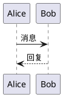

# 插件系统示例

这是一个展示 Markdown Preview 插件系统的示例文档。

## Mermaid 图表


## PlantUML 图表



## ApexCharts 图表

```apexcharts
{
  "chart": {
    "type": "line"
  },
  "series": [{
    "name": "销量",
    "data": [30, 40, 35, 50, 49, 60, 70]
  }],
  "xaxis": {
    "categories": ["一月", "二月", "三月", "四月", "五月", "六月", "七月"]
  }
}
```

## Git Diff

```diff
- old line of code
+ new line of code
  unchanged line
```

## GeoJSON 地图

```geojson
{
  "type": "FeatureCollection",
  "features": [{
    "type": "Feature",
    "properties": {
      "name": "北京"
    },
    "geometry": {
      "type": "Point",
      "coordinates": [116.4074, 39.9042]
    }
  }]
}
```

## 音乐乐谱 (ABC)

```abc
X:1
T:简单旋律
M:4/4
L:1/4
K:C
C D E F|G A B c|
```
